
<h1 align="center"> 篮球NBA周边商城vue</h1>

## 简介
篮球NBA周边商城：角色分为管理员、用户；商品管理、订单管理、用户管理、新闻资讯、个人中心等功能，支持商品分类、评价、收货地址管理及多种支付方式。    --计算机毕业设计源码；毕设源码；java毕业设计源码

## 联系方式

<h3 align="center">获取完整代码与数据库文件 + 微信：deepguan QQ: 86050149 QQ群: 783742310</h3>

<h3 align="center">可帮忙远程部署 包运行成功！提供远程部署、修改代码、设计文档指导、代码讲解等服务！</h3>

## 功能介绍（完整见运行截图）
管理员：基本功能包括用户的登录、注册、退出及权限管理。系统提供直观的后台管理界面，支持用户管理、商品管理、订单管理及查看用户反馈。管理员可利用商品管理页面进行商品信息的录入、编辑和审核。订单管理模块允许按订单编号或商品名称查询，帮助管理员高效跟踪订单状态。此外，系统支持分类管理、球队管理和客服管理，旨在提升运营效率和用户满意度。

用户：主要功能涵盖从登录注册到购买商品的全流程操作。用户可以通过首页导航访问不同商品类别和球员周边产品，对商品详情、评价进行查看。购物过程中支持购物车、数量选择和多种支付方式。个人中心功能完善，提供订单查询、地址管理和收藏功能。充值页面提供微信、支付宝等多种支付选项，确保便捷的购买体验和账户管理。整体界面友好，注重视觉设计和用户交互体验。

## 运行截图
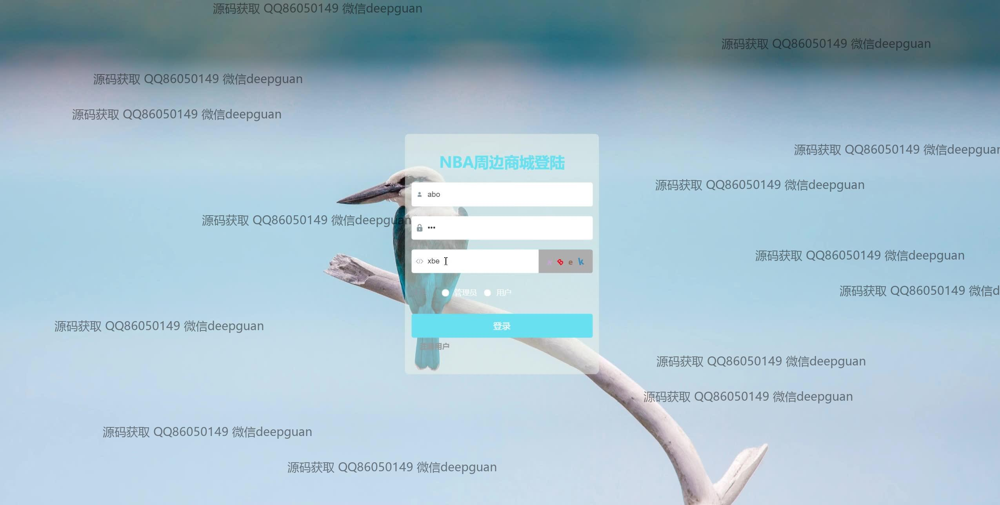

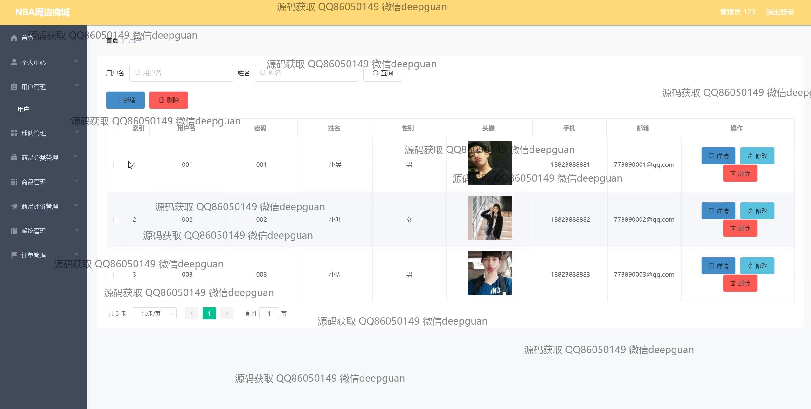
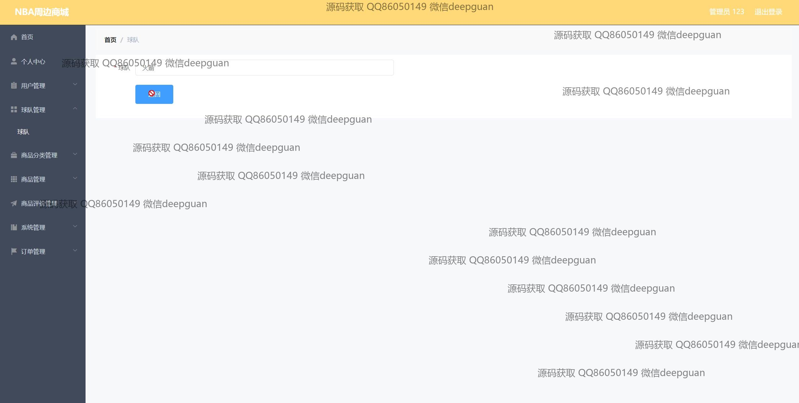
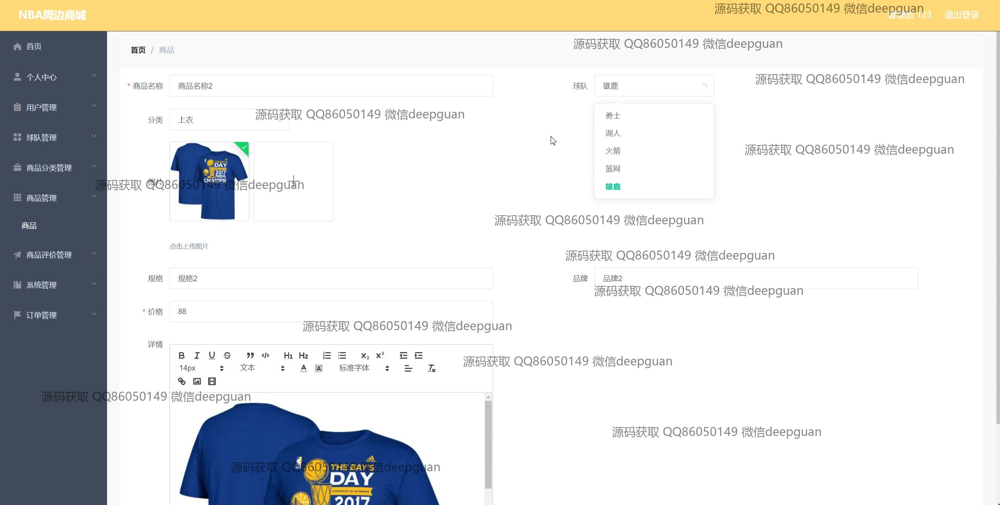
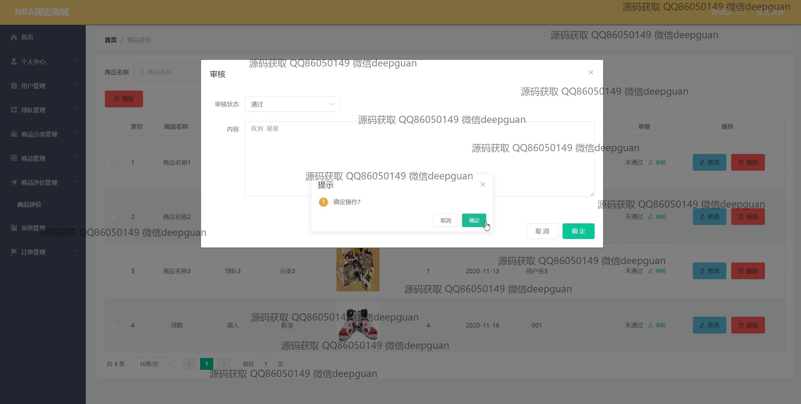
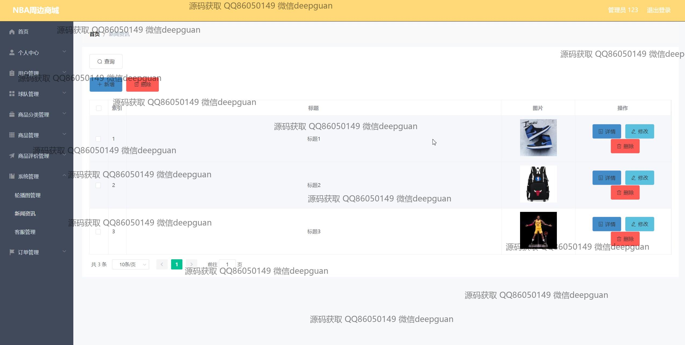
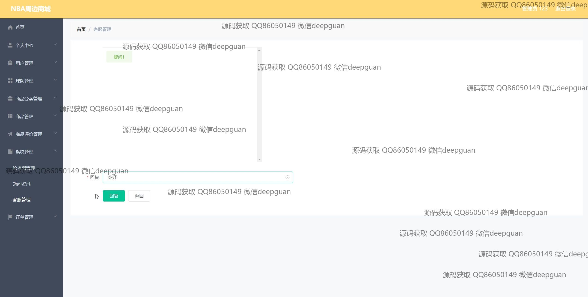
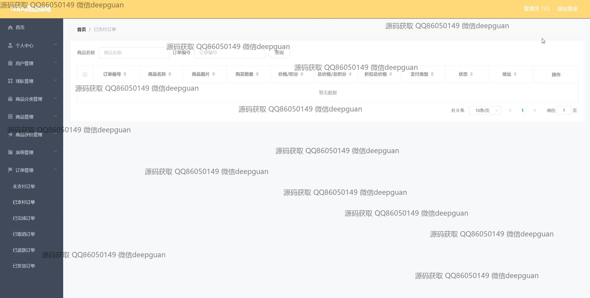
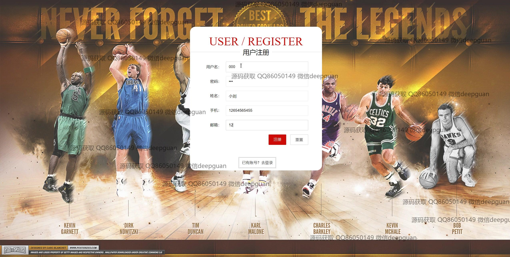
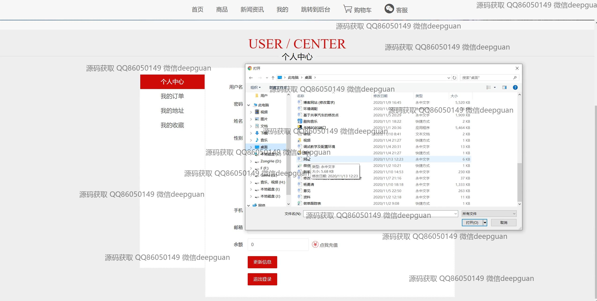
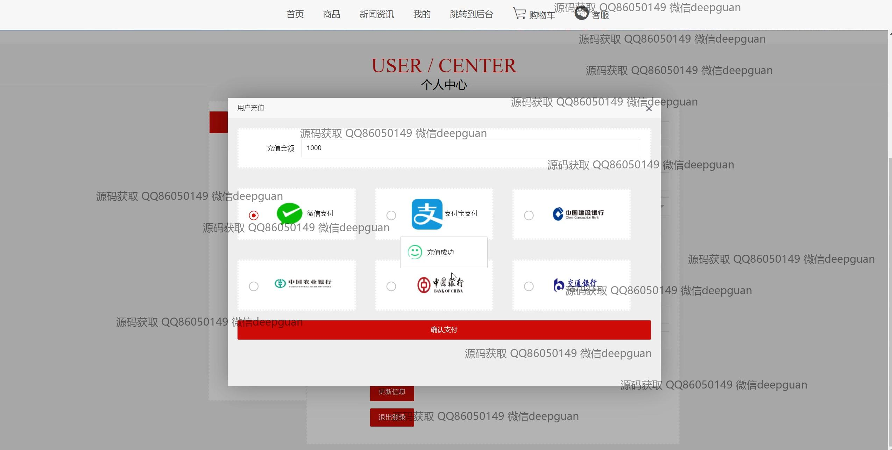
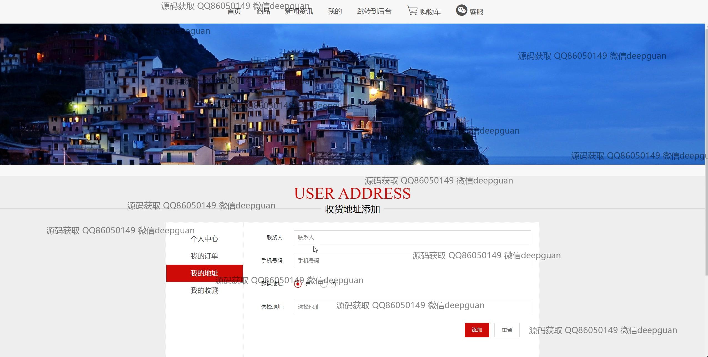
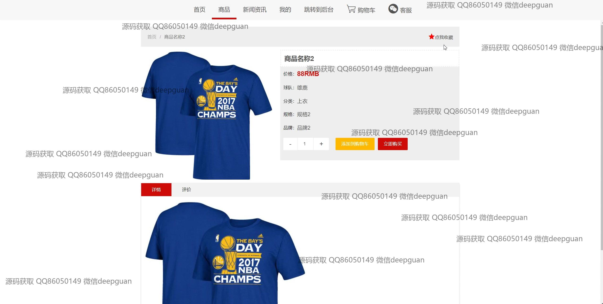
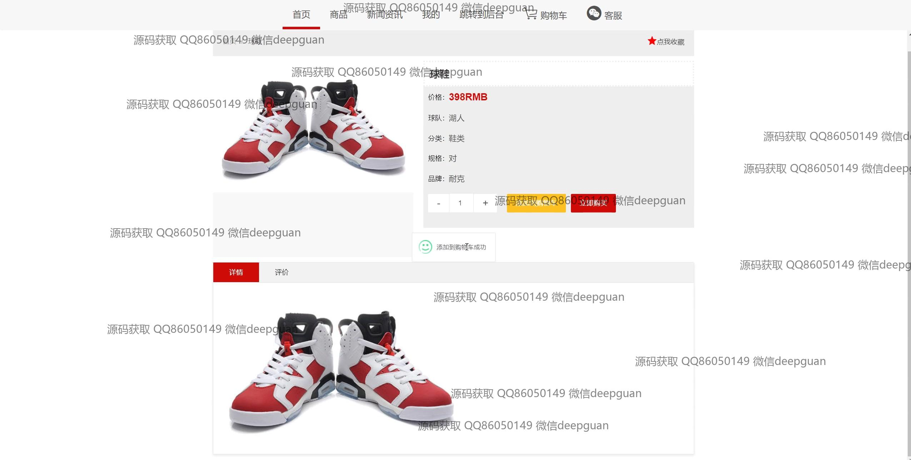
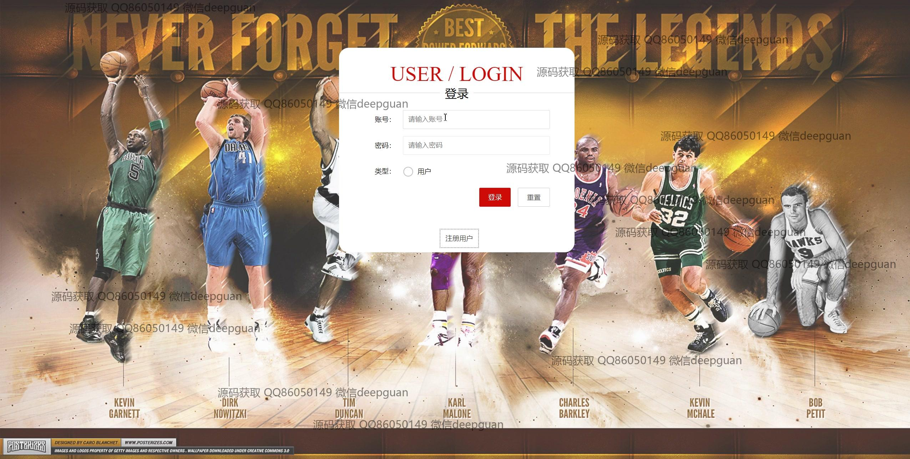
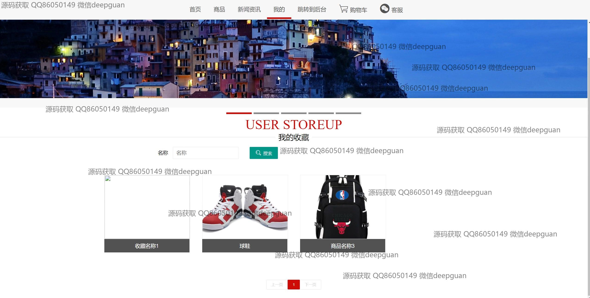
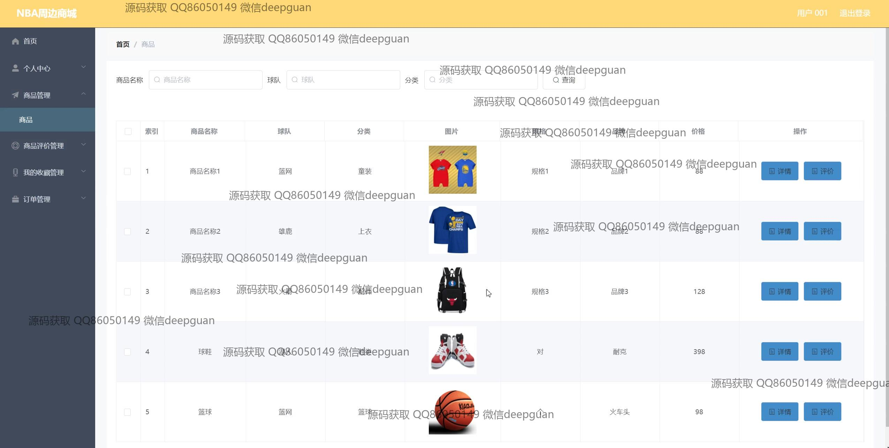
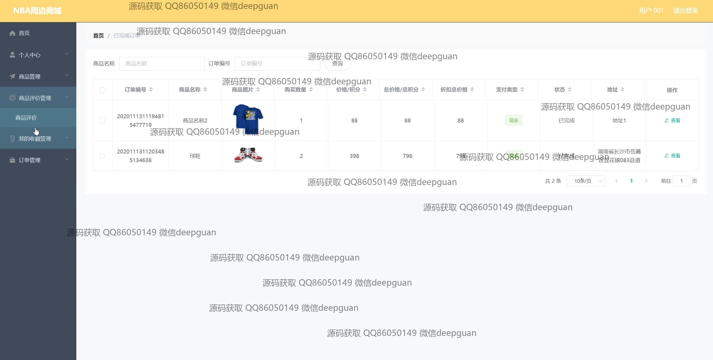

本代码来源于网络,仅供学习参考使用!

